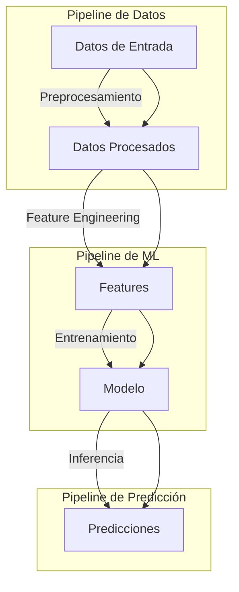
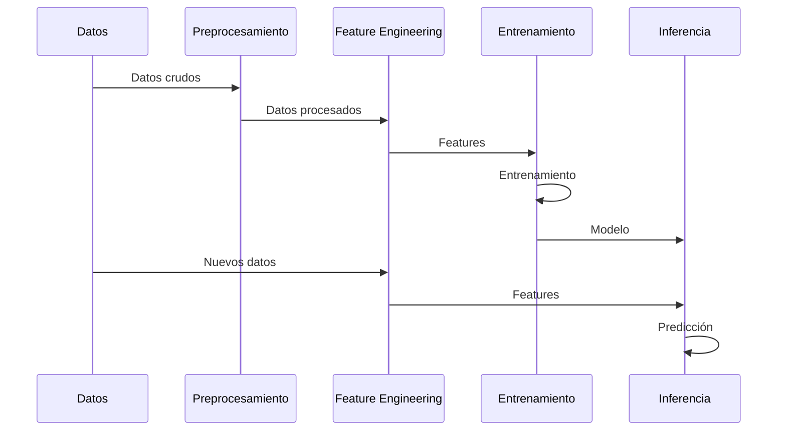

# Arquitectura del Sistema

## Visión General

El sistema está diseñado siguiendo principios de arquitectura modular y contenedores, permitiendo un flujo de trabajo eficiente desde el preprocesamiento hasta la inferencia.



## Componentes Principales

### 1. Módulo de Preprocesamiento
- **Clase**: `DataProcessor`
- **Funcionalidades**:
  - Limpieza de datos
  - Transformación logarítmica: \(y = \log(1 + x)\)
  - Manejo de valores atípicos
  - Validación de datos

### 2. Módulo de Feature Engineering
- **Clase**: `FeatureEngineer`
- **Características Generadas**:
  - Temporales (EMA, tendencias)
  - Precio (volatilidad, ratios)
  - Categorías (promedios, interacciones)
- **Normalización**: StandardScaler \(z = \frac{x - \mu}{\sigma}\)

### 3. Módulo de Entrenamiento
- **Modelo**: LightGBM
- **Hiperparámetros**:
  ```python
  params = {
      'objective': 'regression',
      'metric': 'rmse',
      'boosting_type': 'gbdt',
      'num_leaves': 31,
      'learning_rate': 0.05,
      'feature_fraction': 0.9
  }
  ```
- **Función de Pérdida**: \(L = \frac{1}{N}\sum_{i=1}^N (y_i - \hat{y}_i)^2\)

### 4. Módulo de Inferencia
- **Pipeline**:
  1. Carga del modelo
  2. Preprocesamiento de datos nuevos
  3. Generación de features
  4. Predicción
  5. Post-procesamiento: \(y_{real} = \exp(y_{pred}) - 1\)

## Arquitectura de Contenedores

### 1. Contenedor de Preprocesamiento
```dockerfile
FROM python:3.9-slim
WORKDIR /app
COPY requirements.txt .
RUN pip install -r requirements.txt
COPY src/ ./src/
ENTRYPOINT ["python", "prep.py"]
```

### 2. Contenedor de Entrenamiento
```dockerfile
FROM python:3.9-slim
WORKDIR /app
COPY requirements.txt .
RUN pip install -r requirements.txt
COPY src/ ./src/
ENTRYPOINT ["python", "train.py"]
```

### 3. Contenedor de Inferencia
```dockerfile
FROM python:3.9-slim
WORKDIR /app
COPY requirements.txt .
RUN pip install -r requirements.txt
COPY src/ ./src/
ENTRYPOINT ["python", "inference.py"]
```

## Flujo de Datos



## Gestión de Dependencias

### Principales Dependencias
```python
pandas>=1.5.0     # Procesamiento de datos
numpy>=1.21.0     # Operaciones numéricas
scikit-learn>=1.0.0  # Preprocesamiento
lightgbm>=3.3.0   # Modelo de ML
```

## Monitoreo y Logging

### Métricas Clave
1. **Calidad de Datos**:
   - Completitud
   - Distribución de valores
   - Detección de anomalías

2. **Rendimiento del Modelo**:
   - RMSE: \(\sqrt{\frac{1}{N}\sum_{i=1}^N (y_i - \hat{y}_i)^2}\)
   - R²: \(1 - \frac{\sum_{i=1}^N (y_i - \hat{y}_i)^2}{\sum_{i=1}^N (y_i - \bar{y})^2}\)

3. **Rendimiento del Sistema**:
   - Tiempo de procesamiento
   - Uso de memoria
   - Latencia de predicción

## Consideraciones de Seguridad

1. **Validación de Datos**:
   - Límites de valores
   - Tipos de datos
   - Integridad referencial

2. **Control de Acceso**:
   - Permisos de archivos
   - Variables de entorno
   - Secretos en Docker

3. **Logging**:
   - Niveles de log
   - Rotación de logs
   - Auditoría 