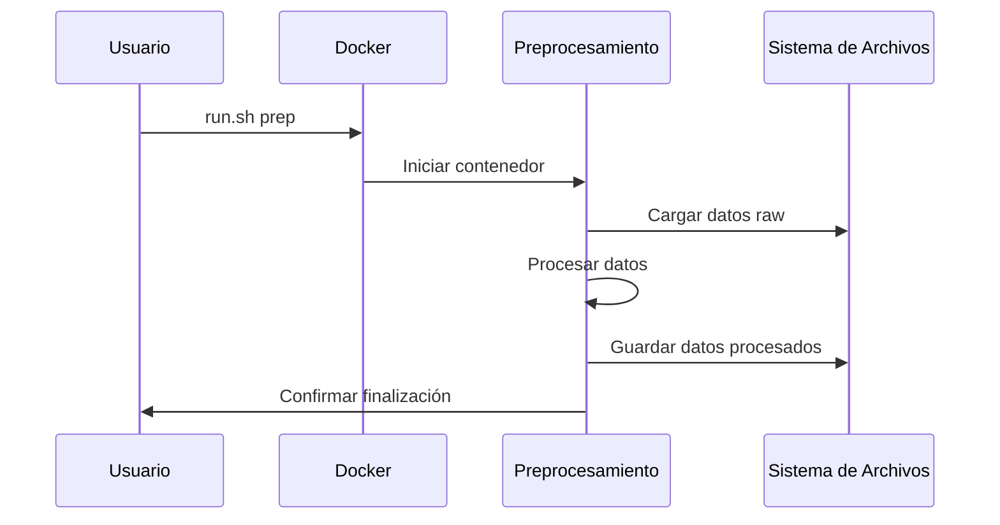
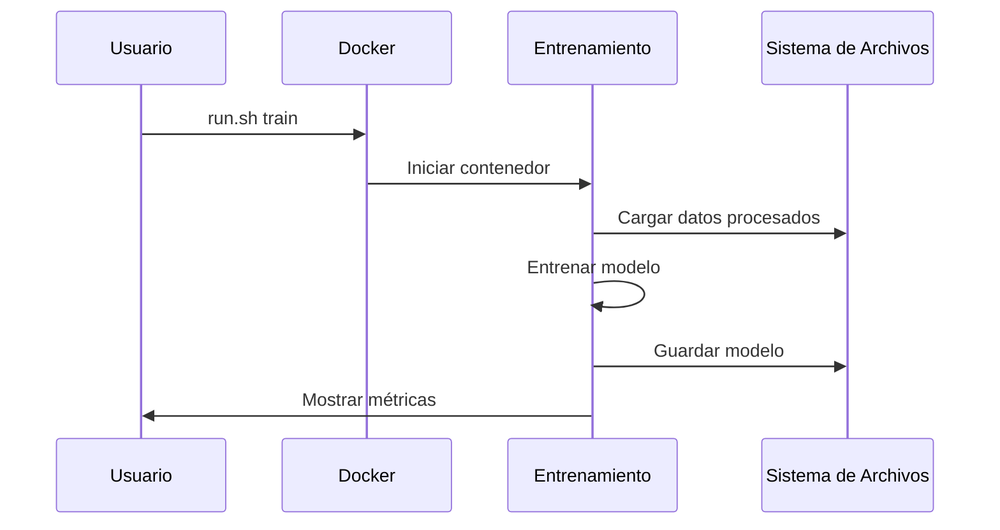
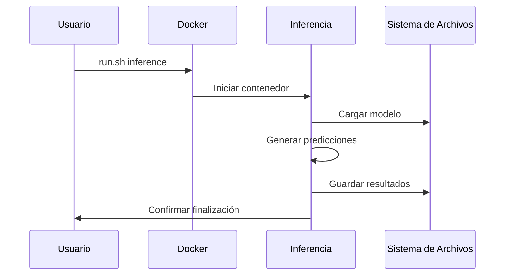

# Guía de Docker

Esta guía detalla los Dockerfiles y comandos utilizados en el sistema, junto con ejemplos de uso.

## Estructura de Dockerfiles

### Dockerfile de Preprocesamiento

```dockerfile
# Dockerfile.prep
FROM python:3.9-slim

# Configuración del directorio de trabajo
WORKDIR /app

# Copiar archivos de requisitos
COPY requirements.txt environment.yml ./

# Instalar dependencias
RUN apt-get update && \
    apt-get install -y build-essential && \
    pip install --no-cache-dir -r requirements.txt

# Copiar código fuente
COPY prep.py ./
COPY src/ ./src/

# Crear directorios necesarios
RUN mkdir -p /app/data/raw /app/data/prep

# Configurar PYTHONPATH
ENV PYTHONPATH=/app

# Comando por defecto
CMD ["python", "prep.py"]
```

### Dockerfile de Entrenamiento

```dockerfile
# Dockerfile.train
FROM python:3.9-slim

# Configuración del directorio de trabajo
WORKDIR /app

# Copiar archivos de requisitos
COPY requirements.txt environment.yml ./

# Instalar dependencias
RUN apt-get update && \
    apt-get install -y build-essential && \
    pip install --no-cache-dir -r requirements.txt

# Copiar código fuente
COPY train.py ./
COPY src/ ./src/

# Crear directorios necesarios
RUN mkdir -p /app/data/prep /app/models

# Configurar PYTHONPATH
ENV PYTHONPATH=/app

# Comando por defecto
CMD ["python", "train.py"]
```

### Dockerfile de Inferencia

```dockerfile
# Dockerfile.inference
FROM python:3.9-slim

# Configuración del directorio de trabajo
WORKDIR /app

# Copiar archivos de requisitos
COPY requirements.txt environment.yml ./

# Instalar dependencias
RUN apt-get update && \
    apt-get install -y build-essential && \
    pip install --no-cache-dir -r requirements.txt

# Copiar código fuente
COPY inference.py ./
COPY src/ ./src/

# Crear directorios necesarios
RUN mkdir -p /app/data/prep /app/models /app/output

# Configurar PYTHONPATH
ENV PYTHONPATH=/app

# Comando por defecto
CMD ["python", "inference.py"]
```

## Comandos y Ejemplos

### Construcción de Imágenes

Para construir todas las imágenes Docker:

```bash
./docker/build.sh
```

Salida esperada:
```
[+] Building docker image ml-price-prep:latest
 => [internal] loading build definition         0.1s
 => => transferring dockerfile: 37B             0.0s
 ...
[+] Successfully built ml-price-prep:latest
[+] Building docker image ml-price-train:latest
...
[+] Successfully built ml-price-train:latest
[+] Building docker image ml-price-inference:latest
...
[+] Successfully built ml-price-inference:latest
```

### Preprocesamiento de Datos

Para ejecutar el preprocesamiento:

```bash
./docker/run.sh prep --data-dir /path/to/data
```

Ejemplo de salida:
```
[INFO] Starting data preprocessing...
[INFO] Loading raw data from /path/to/data/raw
[INFO] Applying transformations...
[INFO] Saving processed data to /path/to/data/prep
[INFO] Preprocessing completed successfully
```

### Entrenamiento del Modelo

Para entrenar el modelo:

```bash
./docker/run.sh train --model-name mi_modelo
```

Ejemplo de salida:
```
[INFO] Starting model training...
[INFO] Loading processed data...
[INFO] Training LightGBM model...
Epoch [1/100]: loss=0.245, val_loss=0.238
Epoch [2/100]: loss=0.198, val_loss=0.192
...
[INFO] Model saved as /app/models/mi_modelo.pkl
```

### Inferencia

Para realizar predicciones:

```bash
./docker/run.sh inference --model-name mi_modelo --output-dir /path/to/output
```

Ejemplo de salida:
```
[INFO] Loading model mi_modelo...
[INFO] Processing input data...
[INFO] Generating predictions...
[INFO] Saving results to /path/to/output/predictions.csv
[INFO] Inference completed successfully
```

## Estructura de Directorios

```
project/
├── docker/
│   ├── Dockerfile.prep
│   ├── Dockerfile.train
│   ├── Dockerfile.inference
│   ├── build.sh
│   └── run.sh
├── data/
│   ├── raw/
│   └── prep/
├── models/
├── output/
└── src/
```

## Ejemplos Visuales

### Flujo de Preprocesamiento



### Flujo de Entrenamiento



### Flujo de Inferencia



## Notas Importantes

1. **Volúmenes**: Los contenedores utilizan volúmenes Docker para persistir datos:
   - `/app/data`: Datos de entrada y procesados
   - `/app/models`: Modelos entrenados
   - `/app/output`: Resultados de inferencia

2. **Variables de Entorno**: Se pueden configurar mediante:
   ```bash
   ./docker/run.sh [comando] --env-file .env
   ```

3. **Recursos**: Los contenedores están configurados para usar:
   - CPU: 4 cores por defecto
   - RAM: 8GB por defecto
   - GPU: Opcional, requiere NVIDIA Docker

4. **Logs**: Los logs se almacenan en:
   ```
   /app/logs/[prep|train|inference].log
   ``` 